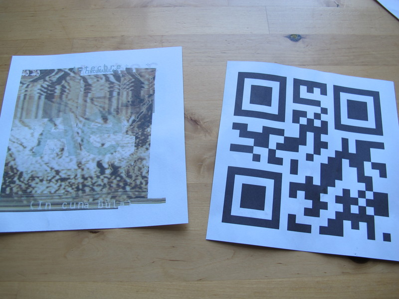

# QR music player

Based on an idea from [Dave Murray-Rust](http://www.mo-seph.com/), this is a set of small scripts that lets you get 'hands on' with your digital music collection.

Print out your album art on one side and a version 1 (smallest size) QR code on the other (not yet automated).

A webcam on your computer/Raspberry Pi picks up the QR code using zlib and starts the album playing.

A Raspberry Pi with 640x480 usb webcam responds within a second of showing the QR code.

See a [video demo here](http://youtu.be/DuRMDblAJZM).

# Scripts

## cam_qr

* Starts the webcam, uses PIl to convert an image from open cv format to something zlib understands, 
* Uses zlib to search for QR codes,
* If one is found, search database and pass album name to mpc.

## mpc control

* Defines a single function that will start a new album playing if it isn't already

## make_qr

* Creates a new QR code using QR code python module, just picks a random number ATM.

# Limitations

* This is a proof of concept - pretty shoddy code!
* With my 640x480 webcam it works up to about 1m away with a 15cm QR code. A higher def camera will increase this distance.
* Only works with mpc 

# Want to make it better?

* A real database, and way of generating it,
* Auto generate pdfs with QR and album art for printing,
* Extra QR codes to stop and start,
* Chop off bottom of image to make scanning quicker,
* Other music controllers (currently only works with mpc),

# Pre requisites

* sudo apt-get install python-zbar
* python opencv (cv2) - maybe we can avoid this?
* python (pil) Image - can avoid this too?
* pip install qrcode
* mpc and mpd for music playing

# License

This work is licensed under a [Creative Commons Attribution-ShareAlike 4.0 International License](http://creativecommons.org/licenses/by-sa/4.0/deed.en_GB).
